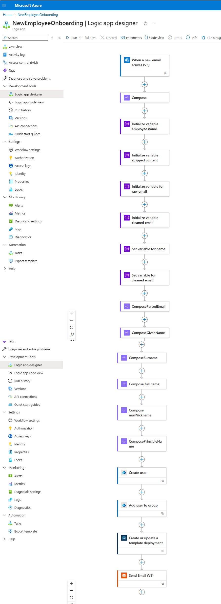

# Automated-Onboarding-Azure-Identities-and-Governance
Onboard Automator streamlines and automates employee onboarding into Azure Entra ID, assigning necessary Azure resources via Logic Apps and Azure Resource Manager. It simplifies user creation, role assignments, and resource provisioning, significantly reducing workload and administrative overhead.

![flow graph]Automatordesign.png

## Azure Services Used
- **Azure Entra ID**
- **Azure Logic Apps**
- **Azure Email Service** (part of Logic Apps connector)
- **Azure Resource Manager**

## Steps

### Azure AD Setup
Set up a new Azure AD instance (if not already present) using the Azure portal. This involves configuring your Azure AD to manage identities and governance, ensuring that new employees can be onboarded smoothly.

### Logic App Workflow Design
Design a Logic App workflow triggered by an event, such as an entry in a SharePoint list or an email to a specific mailbox, indicating a new employee hire. This workflow will automate various tasks involved in the onboarding process.

### Azure AD User Creation
Use the Azure AD connector in Logic Apps to automatically create a new user in Azure Entra ID based on the details provided in the trigger event. This eliminates the need for manual user creation and ensures consistency.

### Role and Group Assignment
Assign predefined roles and groups to the new user based on the job position or department indicated in the trigger. This step is crucial for providing the new employee with the appropriate access and permissions.

### Resource Provisioning
Use the Azure Resource Manager connector in Logic Apps to provision any necessary Azure resources for the user, such as Virtual Machines (VMs) or specific permissions. This ensures that the new employee has all the tools and resources they need from day one.

### Welcome Email
Leverage the Email connector in Logic Apps to send a welcome email to the new hire with instructions and necessary access details. This helps new employees get up to speed quickly and feel welcomed into the organization.

### Monitoring and Review
Monitor and review the onboarding process through Logic Apps runs history and Azure AD logs to ensure smooth operations. Regular reviews help in identifying any issues and improving the onboarding process continuously.

